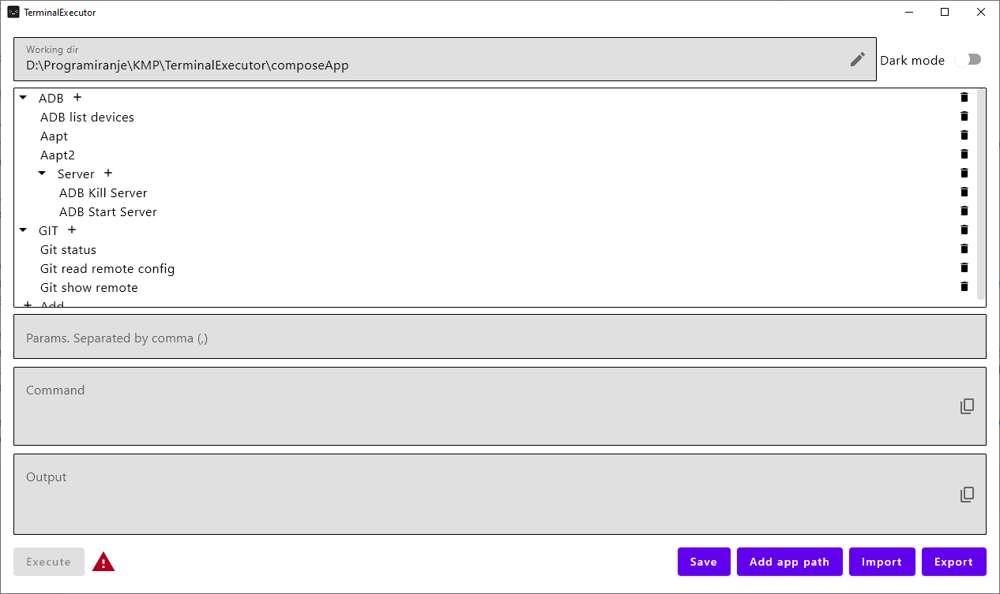

# Terminal Executor

## Table of content
- [Overview](#overview)
- [How to use](#how-to-use-the-terminal-executor)
- [Import Export](#import--export)
- [Tech Stack](#tech-stack)
- [Getting Started](#getting-started)
- [License](#license)
- [Contact](#contact)

## Overview
The Terminal Executor is a straightforward application developed using Kotlin Multiplatform (KMP). Its primary function is to execute console commands specified by the user.

## How to use the Terminal Executor?
To utilize the Terminal Executor, users can begin by adding commands. There are two types of entries: Groups and Commands. While there is no limit to the nesting of groups, it is advisable to maintain an organized structure for ease of use. Please note that only groups can be added to the root list. Once a group has been created, any number of commands can be added beneath it.

Additionally, users have the option to incorporate input parameters within the commands. To do so, include `$param_number` in the command string and utilize the parameters input field to specify the corresponding values.

For instance:

Command: `git log -n $1 --author=$2`

Parameters: `5,my_name`

Output Command: `git log -n 5 --author=my_name`

The final command will be displayed in parentheses within the command field. An illustrative example can be found in the image below.

Commands can be executed by either double-clicking on the list entry or by pressing the Execute button.

**Important note!**
It is crucial to save your configuration before exiting the application by clicking the Save button. Failure to do so will result in the loss of all unsaved progress.

## Import / Export
You can import an existing configuration file by using the `Import` button. The configuration file contains all previously added console commands.

**Important note!**
Be aware that importing a configuration will overwrite your existing settings. Configuration merging is slated for a future update.

To share your configuration, use the `Export` button to save your current settings in the JSON file that you can share with others.

# Working directory
The default working directory is set to the program's root directory. However, you may modify it to a specific directory as needed. The working directory is where all commands are executed.

## Tech Stack
- **[Kotlin Multiplatform](https://kotlinlang.org/docs/multiplatform.html)**: Enables code sharing between different platforms.
- **[Coroutines](https://kotlinlang.org/docs/coroutines-overview.html)**: Used for asynchronous programming and concurrency.
- **[Compose UI](https://developer.android.com/jetpack/androidx/releases/compose-ui)**: A modern UI toolkit for building native UIs across all platforms, including Android, iOS, and desktop, using a single codebase. Compose UI simplifies and accelerates UI development with its declarative approach and powerful features.
- **[ViewModel](https://developer.android.com/topic/libraries/architecture/viewmodel)**: The ViewModel component, used for managing UI-related data in a lifecycle-conscious way. In this project, ViewModel is utilized specifically for desktop development, allowing data to survive configuration changes and aiding in separating the UI logic from the UI controller.
- **Kotlin Serialization - JSON** A Kotlin library used for serializing and deserializing Kotlin objects to and from JSON.

## Getting Started
To build and run the project, follow these steps:
1. Clone the repository.
2. Open the project in Android Studio or your preferred IDE.
3. Build the project and run the application on your desired platform using green play button in your IDE. If that does not work, you can use `./gradlew run` gradle task to to run the project, or use gradle task list `Tasks->compose desktop->run`.

## License
This project is licensed under the [Apache-2.0 license](LICENSE).

## Contact
For any questions or support, please contact me using issues in this repository.